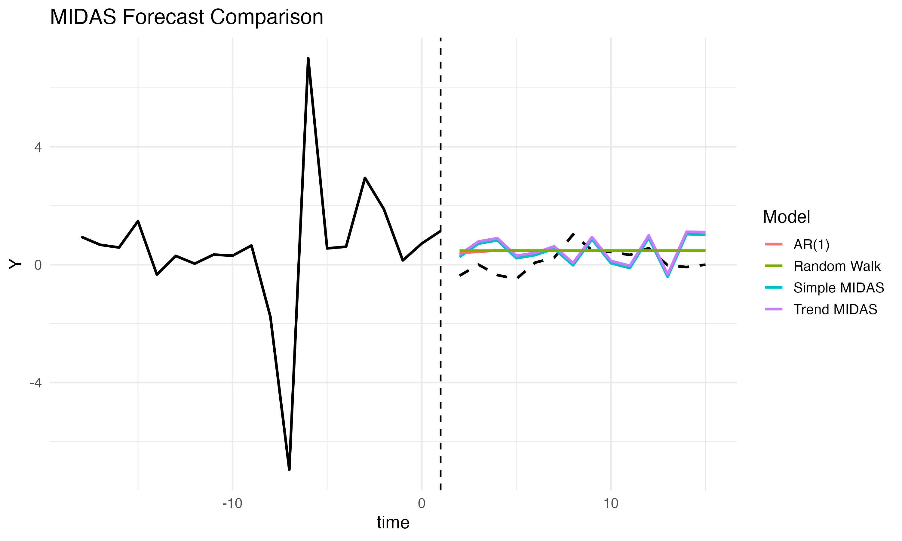

```{r setup, include=FALSE}
# Make the image available inside the preview root (submission/src)
src_path <- file.path("..", "output", "midas_forecast_plot.png")
dst_path <- file.path(".", "midas_forecast_plot.png")
if (file.exists(src_path)) try(suppressWarnings(file.copy(src_path, dst_path, overwrite = TRUE)), silent = TRUE)

# Also copy the evaluation CSV produced by midas.qmd
csv_src <- file.path("..", "output", "mse_results.csv")
csv_dst <- file.path(".", "mse_results.csv")
if (file.exists(csv_src)) try(suppressWarnings(file.copy(csv_src, csv_dst, overwrite = TRUE)), silent = TRUE)
```


## Motivation: Why Mixed Frequency?
- no loss of information
- gain more insights

## Why MIDAS? 
- reduces parameter proliferation
- cheap & stable

## MIDAS Equation 

Explain every component...
$$
y_t = \beta_0 + \sum_{k=0}^{K} \beta(k;\theta)\, x_{t-k/m} + \varepsilon_t
$$


## Our chosen MIDAS


MIDAS with AR(1) and a trend component
$$
y_t = \beta_0
      + \phi\, y_{t-1}
      + \delta \, t
      + \sum_{k=0}^{K} \beta(k;\theta)\, x_{t - k/m}
      + \varepsilon_t
$$

## Reality...

::: {.panel-tabset}

### Plot
<!-- "../../data/metadata_quarterly.csv" -->


### Evaluation

```{r}
mse <- read.csv("mse_results.csv")
print(mse)
```

:::

## Why MF-VAR?


## MIDAS vs. MF-VAR
- pros and cons MIDAS and MF-VAR
- MIDAS is reduced form of MF-VAR 
- MIDAS is a lot cheaper than MF-VAR


## Methodology: chosen model and estimation approach 
- MF-VAR or MIDAS? 

## Data: variables, frequency, sample period 
- Description of data that we were provided + the additional data that we decided to use 

## Results & Forecast Evaluation: forecasts and assessment  
Pretty plots + tables that show errors, both also with AR(2) benchmark 

## Interpretation: economic meaning and intuition 
tbd

## Takeaways: main findings and policy relevance 
tbd 

## Questions for Mid-Term Meeting
- do we need to choose a model, or can we do both?
- what questions would you ask when seeing our equations on the slides?
- how extensive does our economic indicator need to be?

## Reproducibility: GitHub repository with code & data 

- [Our Repository](https://github.com/mddudko/methods-for-macro-forecasting-2025)