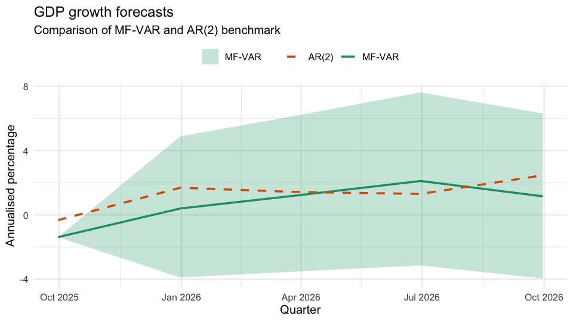
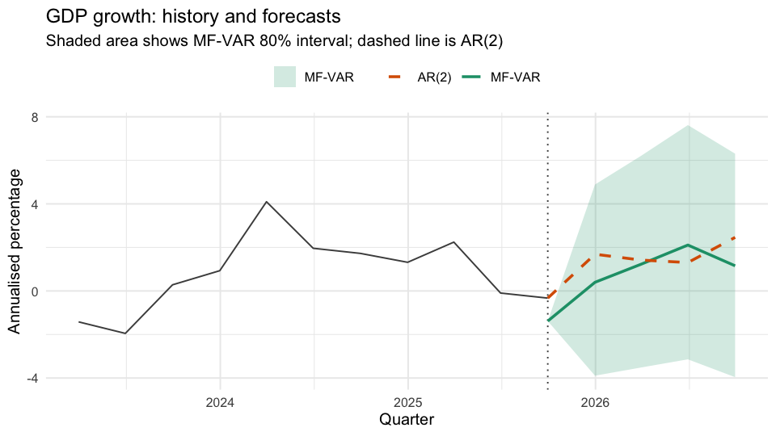
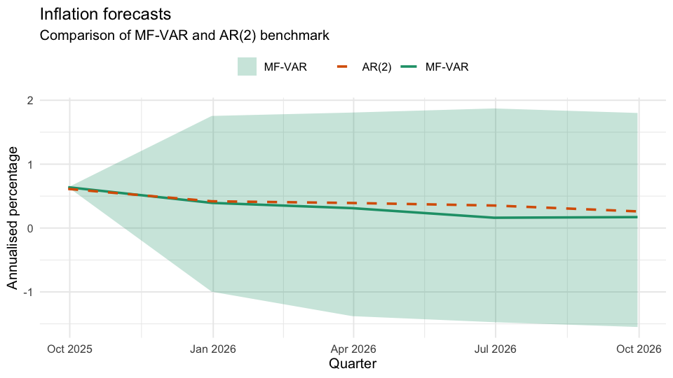
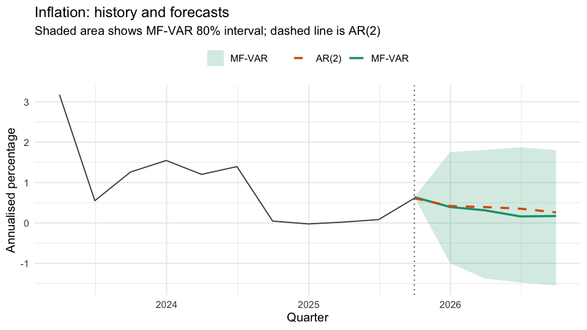
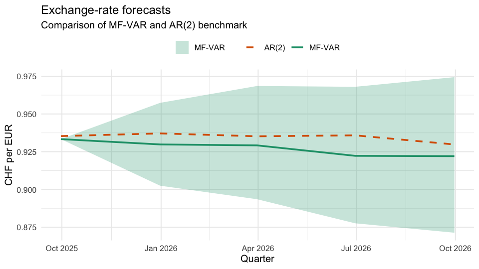
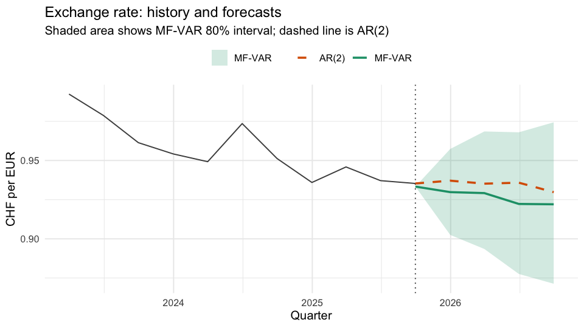
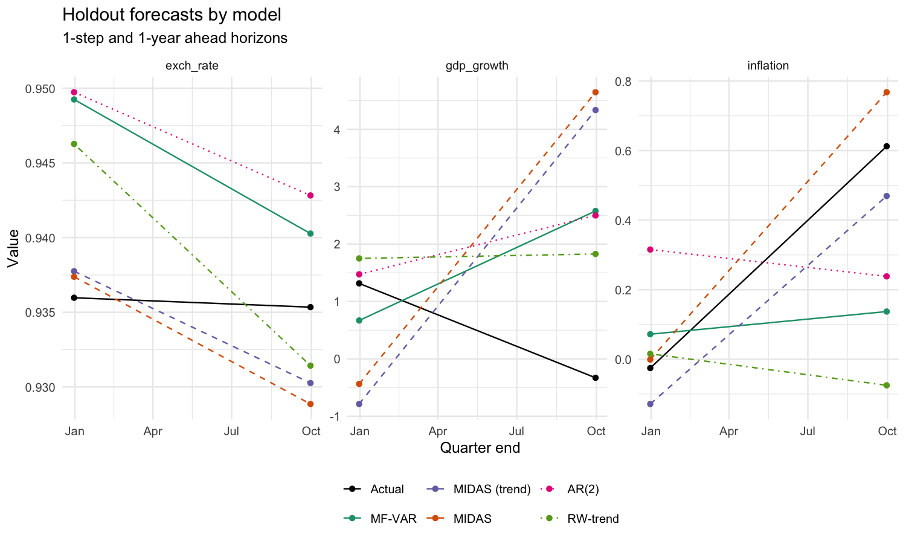
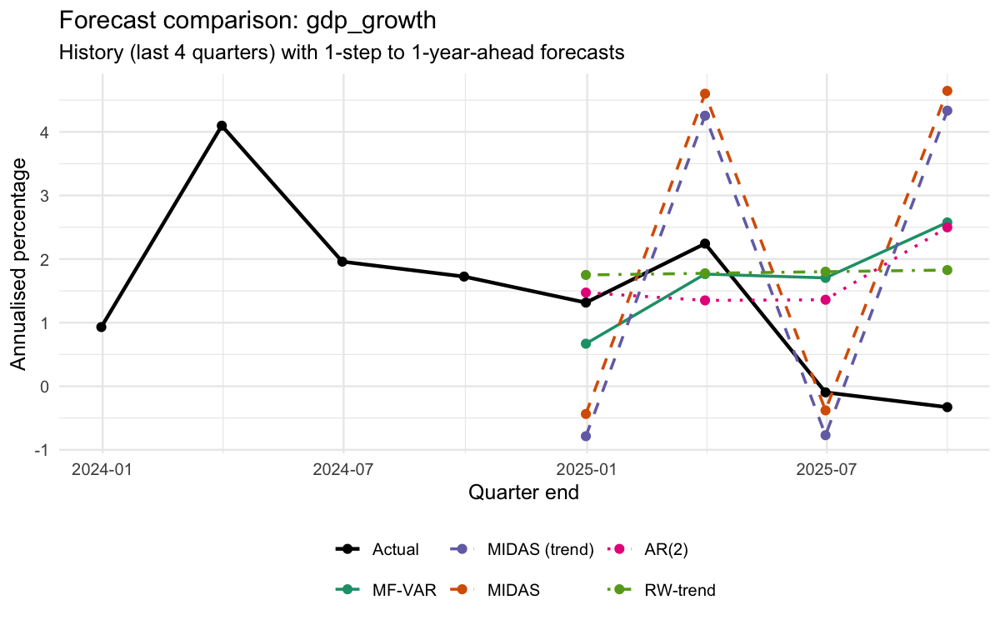
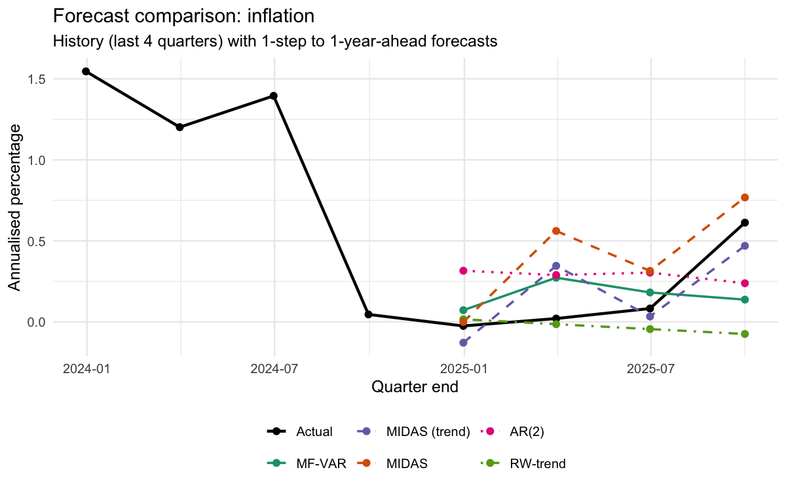
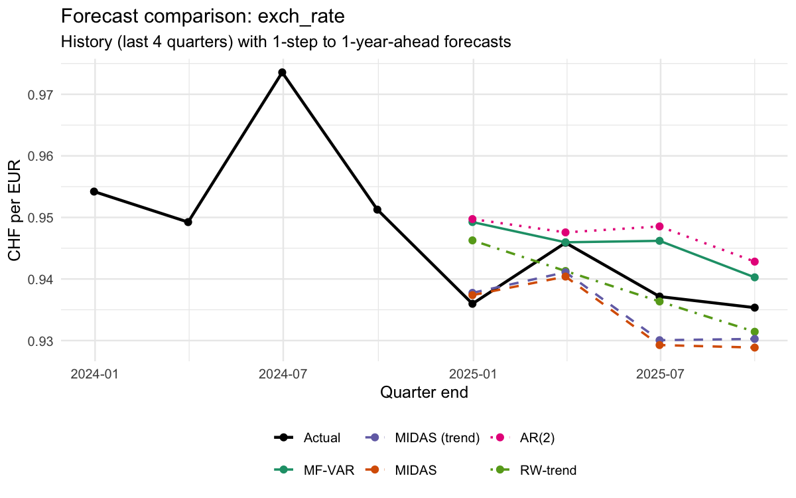

```{r setup, include=FALSE}
# Copy relevant artifacts from submission/output/ so the slides render self-contained
copy_safe <- function(rel_src, rel_dst = basename(rel_src)) {
  src <- file.path("..", "output", rel_src)
  dst <- file.path(".", rel_dst)
  if (file.exists(src)) try(suppressWarnings(file.copy(src, dst, overwrite = TRUE)), silent = TRUE)
}

# Plots: MF-VAR forecasts and benchmarks
lapply(c(
  "midas_forecast_plot.png",
  "model_benchmark_plot.png",
  "model_benchmark_plot_inflation.png",
  "model_benchmark_plot_gdp_growth.png",
  "model_benchmark_plot_exch_rate.png",
  "forecast_gdp_growth.png",
  "forecast_gdp_growth_context.png",
  "forecast_inflation.png",
  "forecast_inflation_context.png",
  "forecast_exchange_rate.png",
  "forecast_exchange_rate_context.png"
), copy_safe)

# Tables and summaries
lapply(c(
  "mse_results.csv",
  "model_benchmark_metrics.csv",
  "model_benchmark_holdout_detailed.csv",
  "mfvar_forecasts_targets.csv",
  "mfvar_forecasts_full.csv",
  "forecast_evaluation.csv",
  "forecast_cross_validation.csv",
  "mfvar_summary.txt",
  "model_benchmark_summary.md"
), copy_safe)
```


## Motivation: Why mixed-frequency data?

- Avoid discarding timely monthly indicators when forecasting quarterly targets
- Exploit ragged-edge information (latest months) without waiting for quarterly releases
- Improve short-horizon accuracy while retaining medium-horizon structure

## Two approaches we compare

- MIDAS (regression): parsimonious distributed lags for high-frequency inputs; fast and robust
- MF-VAR (Bayesian state space): full joint dynamics with Minnesota + IW priors; coherent forecasts and uncertainty

## MIDAS in a nutshell

- Quarterly target $y_t$, monthly regressor $x_{t-k/m}$ with weighting polynomial $\beta(k;\theta)$
- Controls parameter proliferation via low-dimensional $\theta$

$$
y_t = \beta_0 + \phi\,y_{t-1} + \sum_{k=0}^{K} \beta(k;\theta)\, x_{t-k/m} + \varepsilon_t
$$


## Our MIDAS specification

- AR(1) + trend
$$
y_t = \beta_0 + \phi\, y_{t-1} + \delta\, t + \sum_{k=0}^{K} \beta(k;\theta)\, x_{t-k/m} + \varepsilon_t
$$

<!-- TODO: model specifications -->

## MIDAS results {.smaller}

::: {.panel-tabset}

### Plot
<!-- "../../data/metadata_quarterly.csv" -->
{width="80%"}

### Evaluation

```{r}
mse <- read.csv("mse_results.csv")
knitr::kable(mse, digits = 3, caption = "MIDAS: MSE results by target")
```

:::

## Why MF-VAR?

- Mixed-frequency VAR embeds monthly and quarterly series into a single state-space system
- Kalman filter handles missing quarterly observations at ragged edges naturally
- Bayesian priors (Minnesota + IW) stabilize estimates in small samples

---

## MF-VAR: state-space form

- Measurement (mixed frequency):
$$ y_t = Z_t\,\alpha_t + \varepsilon_t, \quad \varepsilon_t \sim \mathcal{N}(0, H) $$
- Transition (VAR in companion form):
$$ \alpha_t = T\,\alpha_{t-1} + R\,\eta_t, \quad \eta_t \sim \mathcal{N}(0, Q) $$


<!-- i assume they are speaker notes, so i added them so you don't see them in the slides? -->
::: {.notes}
Notes
- $Z_t$ selects which quarterly/monthly elements are observed at time $t$ (NA rows for not-yet-released data)
- Priors: Minnesota on VAR coefficients, inverse-Wishart on $Q$ (error covariance)
- Inference: Gibbs sampler draws $(B,\Sigma)$ and Kalman filter/smoother for $\alpha_t$

:::

---

## Data and transformations {.smaller}

- Quarterly targets (annualised): `gdp_growth`, `inflation`, `exch_rate`
- Monthly indicator: KOF barometer (`kofbarometer`, fallback `ch.kof.barometer`)
- Pre-processing: `stationarise_quarterly()` stores transforms for back-transforming forecasts

```{r}
knitr::asis_output("- Quarterly CSV: `submission/data/data_quarterly.csv` (date, rvgdp, cpi, wkfreuro)\n- Metadata: see `submission/data/metadata_quarterly*.csv`\n")
```

---

## Model and estimation (MF-VAR)

- Lags, priors, and forecast horizon jointly set via `mfbvar::set_prior()`
- Estimation with `estimate_mfvar_model()` draws posterior using Minnesota/IW
- Forecasts produced for steps 1–4; evaluation compares to AR(2) and RW-trend benchmarks

```{r}
knitr::asis_output("Key targets: gdp_growth, inflation, exch_rate; monthly KOF aligns via `build_Y()` as required by `mfbvar`.\n")
```

---

## MF-VAR summary (from pipeline) {.smaller}

```{r, results='asis'}
if (file.exists("mfvar_summary.txt")) {
  txt <- paste(readLines("mfvar_summary.txt"), collapse = "\n")
  cat("<pre>\n"); cat(txt); cat("\n</pre>\n")
} else {
  cat("MF-VAR summary file not found.")
}
```

---

## Forecasts: MF-VAR (targets)

::: {.columns}
::: {.column width="50%"}

:::
::: {.column width="50%"}

:::
:::

::: {.columns}
::: {.column width="50%"}

:::
::: {.column width="50%"}

:::
:::

::: {.columns}
::: {.column width="50%"}

:::
::: {.column width="50%"}

:::
:::

---

## Benchmarks and comparisons {.smaller}

::: {.panel-tabset}

### Plots
{width="80%"}

### Per-variable plots

::: {.columns}
::: {.column}
{width="80%"}
:::
::: {.column}
{width="80%"}
:::
::: {.column}
{width="80%"}
:::
:::

### Metrics (holdout)
```{r}
bm <- try(read.csv("model_benchmark_metrics.csv"), silent = TRUE)
if (!inherits(bm, "try-error")) {
  bm$horizon <- factor(bm$horizon, levels = c("1-step ahead", "1-year ahead"))
  bm <- bm[order(bm$horizon, bm$model),]
  knitr::kable(bm, digits = 3, caption = "Average metrics across targets (holdout)")
} else {
  cat("Metrics CSV not found.")
}
```

### Metrics (by variable & step) 
<!-- TODO: i think here it only shows part of the actual table, maybe we should try to get this to show all, or split it? -->
```{r}
det <- try(read.csv("model_benchmark_holdout_detailed.csv"), silent = TRUE)
if (!inherits(det, "try-error")) {
  det_short <- subset(det, horizon %in% c("1-step ahead", "1-year ahead"))
  knitr::kable(det_short, digits = 3, caption = "Holdout RMSE/MAE by variable and horizon")
} else {
  cat("Detailed holdout CSV not found.")
}
```

:::

## Methodology: chosen model and estimation approach {.smaller}

- We estimate an MF-VAR with 5 lags, Minnesota prior and IW covariance; forecasts at steps 1–4
- MIDAS baseline with AR(1)+trend using KOF barometer weights
- Benchmarks: AR(2) and Random Walk with drift/trend for robustness

::: {.notes}
Notes
- MIDAS can be seen as a reduced-form restriction on the MF-VAR using a weighting kernel
- MF-VAR delivers coherent joint distributions and natural ragged-edge handling
:::

## Data: variables, frequency, sample {.smaller}

- Quarterly targets:
    -  GDP growth (annualised)
    - CPI inflation (annualised)
    - log CHF/EUR exchange rate
- Monthly indicator: KOF barometer; aggregation handled inside `mfbvar`
- Sample: 1992–2025 (approx.), last quarter reserved for holdout

## Results & Forecast Evaluation  

- 1-step ahead: MF-VAR tends to outperform MIDAS; competitive with AR(2)/RW depending on series
- 1-year ahead: benchmarks sometimes win; MF-VAR improves with richer monthly information
- See plots and tables for per-series details

## Economic Indicator
<!-- use monthly exchange rate for pred. monthly exchange rate? -->
- data: 
    - eu/ch policy rates, 
    - labor market
    - (exchange rates, inflation)
- process: lag, matrix, check multicolinearity, weight

## Work in Progress
- extension: economic indicator
- midas: adding different models, i.e. generalised, unrestricted, non-parametric, etc.
- cross validation: rolling/expanding window

## Questions:
- Do we need to decide on either MIDAS or MF-VARs?
- Can I use swissdata (kof intern) 

<!-- Minna: do you guys think we can leave this out for the midterm presentation and instead focus more on what we want from him, i.e. questions and further To Dos. -->
<!-- 
## Interpretation: economic meaning and intuition 

- KOF barometer adds timeliness that benefits near-term GDP and inflation tracking
- Exchange rate is persistent; simple benchmarks remain hard to beat at longer horizons
- Bayesian shrinkage curbs overfitting in MF-VAR; performance hinges on lag length and indicator relevance

## Takeaways: main findings and policy relevance 

- Mixed-frequency methods exploit monthly signals without waiting for quarterly releases
- MF-VAR provides coherent multi-horizon forecasts and uncertainty; MIDAS is a fast, interpretable baseline
- For policy nowcasting, prefer MF-VAR at short horizons; validate against simple benchmarks -->

## Reproducibility: code & data {.smaller}

- Run MF-VAR pipeline from `submission/`:
  - `Rscript Draft_MFVAR.r` (uses `renv`, writes plots/tables to `submission/output/`)
- MIDAS artifacts generated via `submission/src/midas/midas.qmd`
- Repository: https://github.com/mddudko/methods-for-macro-forecasting-2025